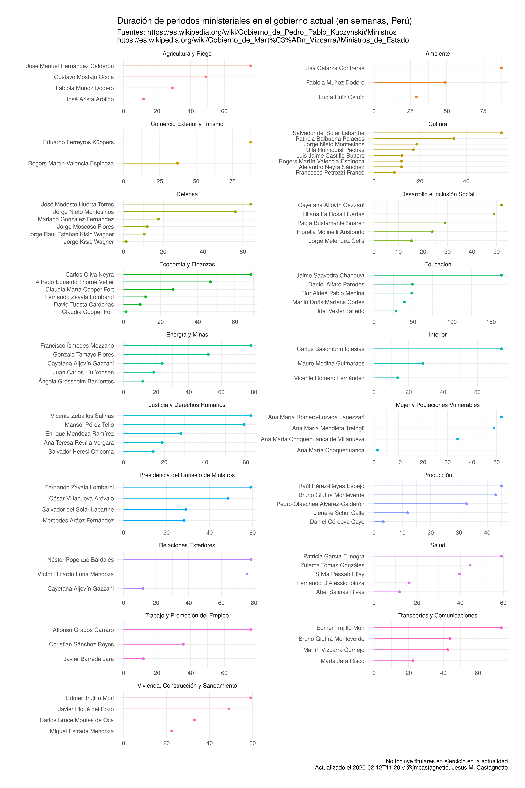

# Gabinetes ministeriales PPK/MVC (Perú)

PPK: Pedro Pablo Kuczynski

MVC: Martin Vizcarra Cor

*Última actualización*: 2020-02-12, 11:20h (PET)

## Archivos:

- `ppk-raw.csv`: gabinetes durante la presidencia de Pedro Pablo Kuczynski (extraídos directamente de Wikipedia: https://es.wikipedia.org/wiki/Gobierno_de_Pedro_Pablo_Kuczynski#Ministros)
- `mvc-raw.csv`: gabinetes durante la presidencia de Martin Vizcarra Cornejo (extraídos directamente de Wikipedia: https://es.wikipedia.org/wiki/Gobierno_de_Mart%C3%ADn_Vizcarra#Ministros_de_Estado)

- `ppk-gabinetes.csv`: archivo normalizado y estandarizado de los gabinetes durante la presidencia de Pedro Pablo Kuczynski
- `mvc-gabinetes.csv`: archivo normalizado y estandarizado de los gabinetes durante la presidencia de Martin Vizcarra Cornejo

- `gabinetes-2016-2020.csv`: archivo combinado de `ppk-gabinetes.csv` y `mvc-gabinetes.csv`

Estructura (csv)

`ppk-raw.csv` y `mvc-raw.csv`

  - ministerio: cartera en la que ejerció
  - titular: titulares del ministerio (separados por final de línea, EOL)
  - periodo: periodos en que sirvió cada titular (separados por final de línea, EOL)

`gabinetes-ppk.csv`, `gabinetes-mvc.csv` y `gabinetes-ppk-mvc.csv`

  - ministerio: cartera en la que ejerció
  - titular: titular del ministerio
  - inicio_str: fecha de inicio (como caracteres)
  - fin_str: fecha de fin (como caracteres)
  - inicio: fecha de inicio (formato ISO: YYYY-MM-DD)
  - fin: fecha de inicio (formato ISO: YYYY-MM-DD)

**Nota**: Los archivos originales fueron procesados usando el script `gabinetes-ppk-mvc.R`

Las estadísticas de la duración (en semanas) en el cargo son:

|  n| promedio| desv_std| mediana| mínimo| máximo|
|--:|--------:|--------:|-------:|------:|------:|
| 84|    37.81|    26.47|   33.57|   1.43| 163.43|

Gráfico de la duración en el cargo (en semanas) por cartera:

